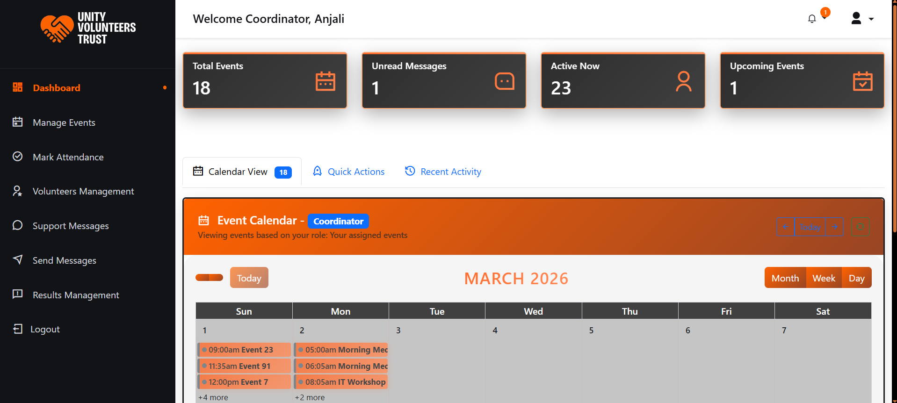
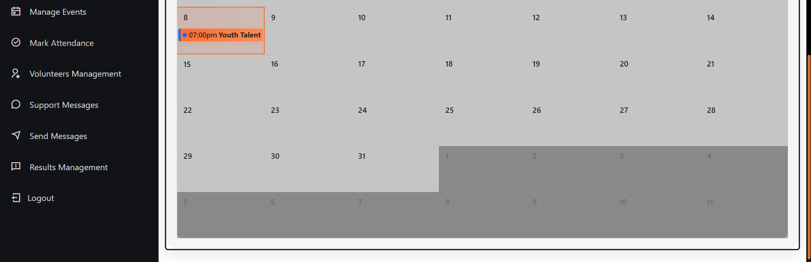
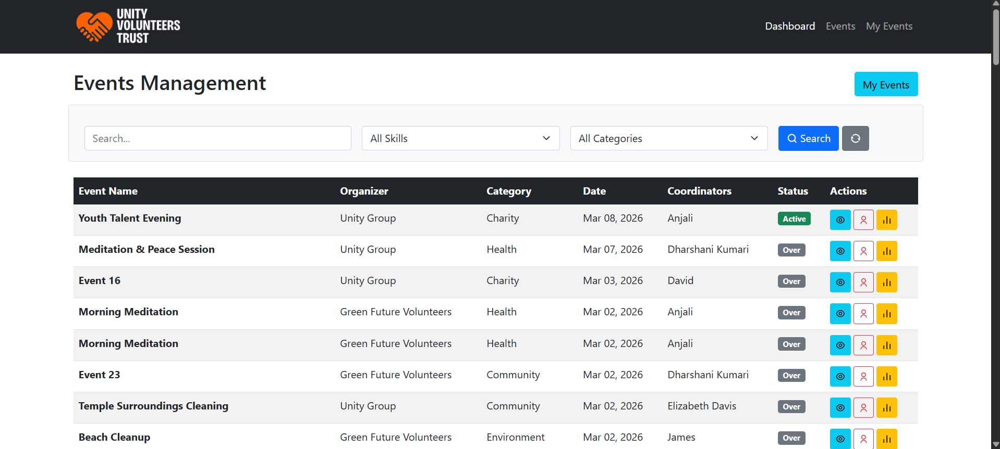
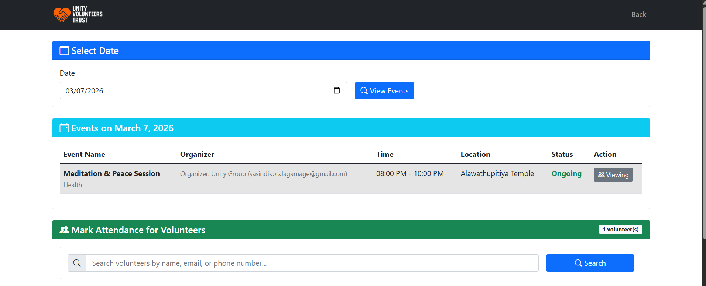
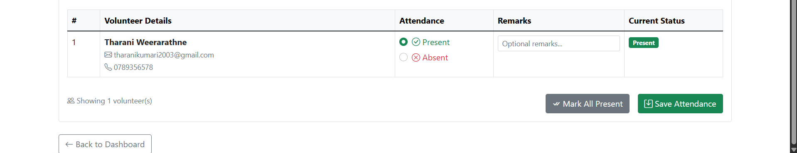
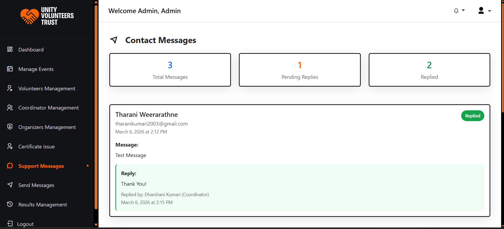
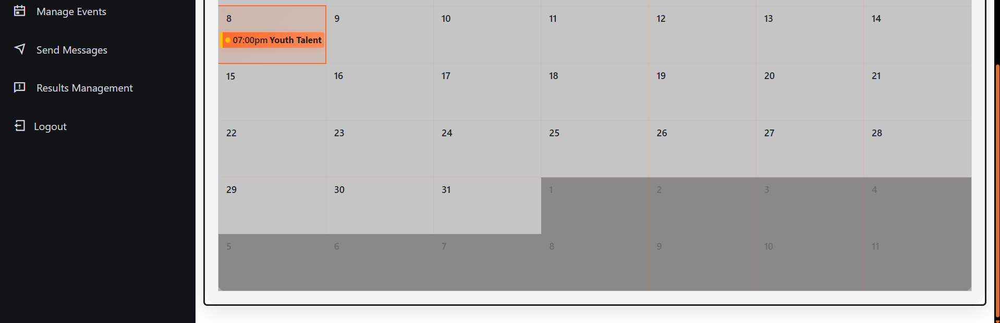

   
  <h1>🤝 Unity Volunteers Trust Platform</h1>
  <h3>AI-Powered Volunteer Management System</h3>
   
  
  <!-- Replace with your actual logo path -->
  
  
   
   
  
  <!-- Tech Stack Badges -->
  

    
    
    
    
    
    
    
  

  
   
  
  <!-- Main Banner Image - Replace with your screenshot -->
  
  
   
   
  
  

    <strong>🏆 Final Year Project | 🎯 AI-Driven | 🤝 Community Focused | 📊 Smart Analytics</strong>
  

  
  

    <a href="#-key-features">✨ Features</a> •
    <a href="#-ai-powered-intelligence">🤖 AI Functions</a> •
    <a href="#-screenshots">📸 Screenshots</a> •
    <a href="#-database-structure">🗄️ Database</a> •
    <a href="#-quick-start">🚀 Quick Start</a>
  

  
   
  

   

## 📖 Introduction

Volunteering is crucial for community growth, but managing large volunteer networks comes with challenges—uncertain availability, poor task alignment, and low engagement. **Unity Volunteers Trust** is an intelligent, web-based platform designed to solve these problems through **AI-powered features** and role-based portals.

> "Bridging the gap between volunteers and opportunities through smart technology."

### 🎯 The Problem We Solve
| Challenge | Our Solution |
|:--|:--|
| ❌ Uncertain volunteer availability | ✅ **AI Participation Prediction** forecasts turnout |
| ❌ Mismatched skills and events | ✅ **Smart Recommendations** match volunteers |
| ❌ Low engagement & recognition | ✅ **Leaderboards & Certificates** motivate |
| ❌ Poor coordination | ✅ **Centralized Portals** streamline management |

 

## 🤖 AI-Powered Intelligence

The heart of our platform—intelligent features that learn and adapt:

### 📊 1. Event Participation Prediction
<table>
  <tr>
    <td width="60%">
      <h4>For Administrators & Coordinators</h4>
      <ul>
        <li>✅ <strong>Model:</strong> Random Forest Regressor</li>
        <li>✅ <strong>Input:</strong> Historical event data, past attendance, event type, day of week</li>
        <li>✅ <strong>Output:</strong> Forecasted volunteer turnout for future events</li>
        <li>✅ <strong>Impact:</strong> Better resource planning, venue selection, task allocation</li>
      </ul>
    </td>
    <td width="40%">
       
      
<i>📈 Prediction Dashboard</i>

    </td>
  </tr>
</table>

### 🎯 2. Smart Volunteer Recommendation
<table>
  <tr>
    <td width="60%">
      <h4>For Volunteers</h4>
      <ul>
        <li>✅ <strong>Model:</strong> Random Forest</li>
        <li>✅ <strong>Analysis:</strong> Volunteer profiles, skills, interests, past participation</li>
        <li>✅ <strong>Matching:</strong> Against event requirements and themes</li>
        <li>✅ <strong>Impact:</strong> Higher engagement, better skill utilization, satisfaction</li>
      </ul>
    </td>
    <td width="40%">
             
      
<i>💡 Personalized Suggestions</i>

    </td>
  </tr>
</table>

### 💬 3. AI Chatbot Assistant
<table>
  <tr>
    <td width="60%">
      <h4>For All Users</h4>
      <ul>
        <li>✅ <strong>Model:</strong> Random Forest</li>
        <li>✅ <strong>Purpose:</strong> 24/7 intelligent assistance</li>
        <li>✅ <strong>Capabilities:</strong> Event recommendations, FAQs, platform guidance</li>
        <li>✅ <strong>Interaction:</strong> Use the same recommendation model</li>
        <li>✅ <strong>Impact:</strong> Reduces coordinator workload, instant user support</li>
      </ul>
    </td>
    <td width="40%">
      
      
<i>🤖 Chatbot Interface</i>

    </td>
  </tr>
</table>

## ✨ Key Features by Role

<b> ▶️ Click to expand screenshot 📸 gallery</b>

<b>👥 Volunteers Module</b>

 

| Feature | Description | Screenshot |
|:--|:--|:--|
| 🔐 **Secure Auth** | Registration/Login with OTP verification | **Login Screen**      **OTP Verification**      **Real time Email**    |
| 🤖 **AI Recommendations** | Personalized event suggestions |     |
| 📅 **Event Calendar** | Visual schedule of joined events |     |
| 🏆 **Leaderboard**  | Top volunteers by participation |  |
| 📜 **Certificates** | Downloadable achievement certificates |        |
| 💬 **AI Chatbot** | 24/7 assistant for queries |  |
| 📝 **Feedback** | Submit event feedback |              |
| 📧 **Notifications** | Email alerts for events | **Internal Notification**      **Real time Email**    |
| ⭐ **Organizer Application** | Apply to become organizer |        |

   

<b>👑Administrators Module</b>
 
 

| Feature | Description | Screenshot Location |
|:--|:--|:--|
| 📊 **AI Predictions** | Forecast event participation |     |
| 📅 **Event Calendar** | Visual schedule of all events |     |
| 👥 **Manage Volunteers** | Add/edit/remove users |     |
| 👤 **Manage Coordinators** | Add/edit/remove coordinators |     |
| 📋 **Event Management** | Create/modify/cancel events |  |
| 📊 **CSV Export** | Export attendance data |  |
| 👥 **View Participants** | See who joined |     |
| 📜 **Certificate Generation** | Generate participation certificates |     |
| ✅ **Approve Events** | Approve past event results |     |
| ⬆️ **Role Approvals** | Approve volunteer-to-organizer requests |     |
| 📝 **Manage Feedback** | Review volunteer feedback |              |

 

<b>📋 Coordinators Module</b>

 

| Feature | Description | Screenshot Location |
|:--|:--|:--|
| 📅 **Calendar View** | Upcoming and completed events |     |
| 👥 **Manage Volunteers** | Add/edit/remove users |     |
| 📋 **View Event Only** | Create/modify/cancel events |  |
| 📝 **Mark Attendance** | Record volunteer attendance |     |
| 📤 **Upload Results** | Add event reports/images |     |
| 📧 **Send Notifications** | Message volunteers | **Send Emails**      **OTP Verification**      **Real time Email**    |
| 📊 **CSV Export** | Export attendance data |  |
| 📝 **Manage Feedback** | Review volunteer feedback |              |

 

<b>🎯 Organizers Module</b>

 

| Feature | Description | Screenshot Location |
|:--|:--|:--|
| 📅 **Personal Calendar** | Events they organize |     |
| ➕ **Create Events** | Schedule new events |  |
| 👥 **View Participants** | See who joined |     |
| 📤 **Event Results** | Upload completion data |     |
| 📝 **Manage Feedback** | Review volunteer feedback |              |

 

 

## 📸 Screenshots Gallery

<b>🖥️ Click to expand full screenshot gallery</b>

 

### 🏠 Dashboard Views
| Admin Dashboard | Coordinator Dashboard | Volunteer Dashboard |
|:---:|:---:|:---:|
|  |  |  |

### 🔐 Authentication
| Login Page | Registration | OTP Verification |
|:---:|:---:|:---:|
|  |  |  |

### 📅 Event Management
| Event List | Create Event | Event Details |
|:---:|:---:|:---:|
|  |  |  |

### 📊 AI Features
| Participation Prediction | Smart Recommendations | AI Chatbot |
|:---:|:---:|:---:|
|  |  |  |

### 🏆 Recognition
| Leaderboard | Certificates | Badges |
|:---:|:---:|:---:|
|  |  |  |

### 📊 Reports & Analytics
| Attendance Report | CSV Export | Feedback Analysis |
|:---:|:---:|:---:|
|  |  |  |

### 📱 Responsive Design
| Mobile View | Tablet View | Desktop View |
|:---:|:---:|:---:|
|  |  |  |

 

